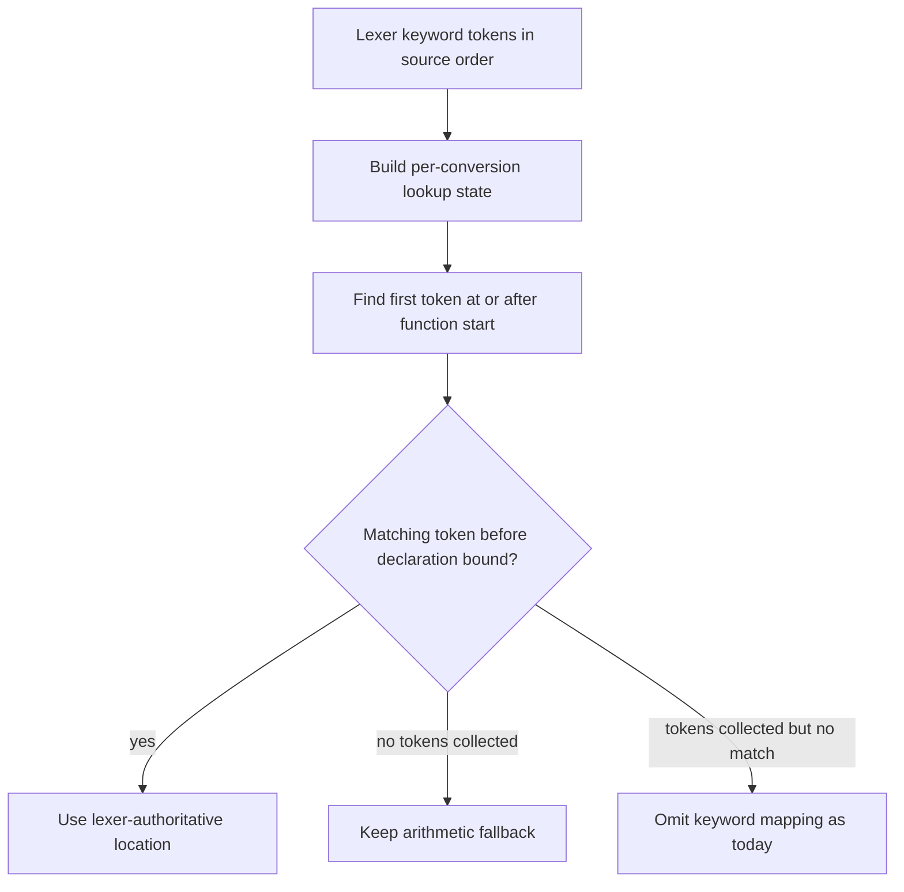

# Volar Keyword Token Lookup - Plan

## Goal Capsule

- **Objective:** Developers working in function-heavy TSRX modules receive editor
  mappings without avoidable quadratic latency.
- **Means:** Replace each function declaration's full lexer-token rescan with a
  bounded indexed lookup while preserving source-span behavior (KTD1).
- **Authority:** The user request and R1-R5 outrank implementation convenience.
  Existing mapping semantics and tests outrank benchmark gains.
- **Execution profile:** Measure first, implement only against a frozen baseline,
  and remove any attempt that fails the performance or semantic gate.
- **Stop conditions:** Do not ship a semantic mapping change or an optimization
  that misses R4. If this hypothesis fails, discard it and validate a different
  non-overlapping bottleneck per R5.
- **Tail ownership:** The LFG pipeline owns review, commit, PR creation, and CI
  follow-through after the implementation passes this plan.

---

## Product Contract

### Summary

Optimize one internal TSRX compiler hot path that performs repeated work in
function-heavy modules. Preserve all generated code, diagnostics, and source
mappings while producing measured before-and-after evidence.

### Problem Frame

`convert_source_map_to_mappings` walks the transformed AST and resolves source
locations for each authored `async` and `function` keyword. The current lookup
starts at the beginning of `ast_from_source.tsrx_keyword_tokens` for every
function declaration. A module with many functions therefore repeats an
increasingly long prefix scan and can turn a source-ordered lookup into quadratic
work on an editor-facing path.

This work must stay distinct from the recent location-free AST cloning, parameter
comment attachment, and local export scope lookup optimizations in PRs #3, #5, and
#7.

### Requirements

**Performance behavior**

- R1. The selected optimization must remove the repeated full-token-list scan from
  Volar mapping generation without changing public APIs.
- R2. Generated code, diagnostics, source AST data, and mapping semantics must
  remain unchanged for the exercised inputs.
- R3. Every emitted keyword mapping must retain its exact lexer-authoritative
  source span for plain functions, async functions, irregular whitespace, comments
  between keywords, nested functions, and function expressions. Preserve the
  control's existing allowance for an omitted keyword mapping when the generated
  source map has no segment for it; never turn that omission into a garbled span.
- R4. On a synthetic function-heavy module, the candidate median must be at least
  20% faster than the frozen `origin/main` control across five isolated runs with
  an identical semantic digest.
- R5. If the candidate misses R4 or changes the semantic digest, remove the
  attempt and validate a different bottleneck that does not overlap PRs #3, #5, or
  #7. Before implementing the replacement, freeze a workload representative of
  that bottleneck; the replacement must improve its median by at least 20% across
  five isolated runs with an identical semantic digest.

**Repository constraints**

- R6. Base the work on commit `630669cdc5303aaf7c067b0ce7fbc24009efc101` from the
  fetched `origin/main` in the isolated worktree.
- R7. Keep the final change internal to compiler implementation and regression
  coverage; do not add a changeset unless execution discovers a user-visible
  contract change.

### Acceptance Examples

- AE1. **Covers R1-R3.** Given a module with many earlier function declarations,
  when a later plain function is mapped, then its `function` mapping uses the
  exact authored source span.
- AE2. **Covers R2-R3.** Given an async function with a comment and irregular
  spacing between `async` and `function`, when Volar mappings are generated, then
  every emitted keyword mapping uses its lexer-authoritative source span, no
  garbled span appears, and a keyword that the control omits because no generated
  segment exists remains omitted.
- AE3. **Covers R2-R3.** Given nested declarations and function expressions whose
  generated traversal order is not assumed to match source order, when mappings
  are generated, then each declaration resolves only tokens inside its own source
  bounds.
- AE4. **Covers R2.** Given a caller that does not collect keyword tokens, when
  mapping generation reaches a function declaration, then the existing arithmetic
  fallback behavior remains intact.

### Scope Boundaries

- Include only the keyword-token lookup, focused shared mapping coverage, and
  ephemeral benchmark evidence needed to prove the change.
- Exclude AST cloning, comment attachment, local export validation, CSS pruning,
  runtime behavior, and unrelated source-map cleanup.
- Exclude committed benchmark infrastructure unless the existing repository
  pattern requires it during implementation.

---

## Planning Contract

### Key Technical Decisions

- KTD1. **Use bounded lookup over source-ordered keyword tokens.** Build lookup
  state once per mapping conversion, locate the first token at or after a
  function's lower source bound, and inspect only tokens before that declaration's
  existing upper bound. This removes repeated prefix scans and does not depend on
  transformed-AST visitation order.
- KTD2. **Reject a shared mutable cursor.** The mapping walker visits generated
  AST structure, so a monotonic cursor would couple correctness to traversal
  order. A lower-bound lookup preserves random access while reducing each
  declaration lookup from a full prefix scan to logarithmic positioning plus a
  tiny bounded scan.
- KTD3. **Keep behavior proof in the shared mapping harness.**
  `packages/tsrx/tests/shared/source-mappings.js` runs against React, Preact,
  Solid, and Vue compiler entry points, which proves the core change across all
  in-repo consumers without target-specific duplicate tests.
- KTD4. **Measure a frozen control and candidate independently.** The benchmark
  must compare the fetched default-branch implementation with the candidate in
  isolated processes, report medians, and require identical generated-code and
  mapping digests before performance numbers count.

### High-Level Technical Design

### Assumptions

- Acorn's token callback leaves `tsrx_keyword_tokens` in ascending source-offset
  order; implementation must confirm this invariant against parser coverage before
  relying on lower-bound lookup.
- A generated module with roughly 6,000 mixed plain and async functions is large
  enough to expose the repeated scan without making the benchmark impractical.
- A 20% end-to-end median reduction is the minimum useful result for this
  synthetic hot-path case. A smaller result triggers R5 rather than a weaker
  success claim.

### Sequencing

1. Establish the semantic digest and frozen-control benchmark before changing
   lookup behavior.
2. Add focused shared characterization for declaration bounds and token spans.
3. Replace the repeated scan and rerun the same benchmark and semantic digest.
4. Remove benchmark scratch files and any abandoned implementation before final
   validation.

### Risks and Dependencies

- **Traversal-order coupling:** A cursor-based optimization can select the wrong
  token when transformed nodes are visited out of source order. KTD1 and AE3 avoid
  that dependency.
- **Boundary mistakes:** Async comments, irregular spacing, anonymous function
  expressions, and nested declarations can contain different distances between the
  node start and `function`. Existing source bounds and AE2-AE3 must remain
  authoritative.
- **Benchmark noise:** Parsing, analysis, printing, and source-map conversion
  share the measured entry point. Isolated runs, medians, a large workload, and an
  exact semantic digest prevent a microbenchmark-only win from being mistaken for
  a useful compiler improvement.
- **Hypothesis risk:** The scan may not dominate total Volar compilation. R4-R5
  require discarding a weak result and continuing the hunt rather than shipping
  speculative complexity.

### Sources and Research

- `packages/tsrx/src/parse/index.js` collects `tsrx_keyword_tokens` through
  Acorn's token callback when `keywordTokens` is enabled.
- `packages/tsrx/src/transform/segments.js` performs the repeated
  `lexer_tokens.find` inside function mapping and owns the optimization.
- `packages/tsrx/tests/shared/source-mappings.js` defines the cross-target
  keyword-span contract, including irregular async/function spacing.
- `packages/tsrx-react/src/index.js`, `packages/tsrx-preact/src/index.js`,
  `packages/tsrx-solid/src/index.js`, and `packages/tsrx-vue/src/index.js` all opt
  into keyword tokens for Volar mapping generation.
- Recent non-overlap evidence: PR #3 optimized location-free AST cloning, PR #5
  optimized parameter comment attachment, and PR #7 optimized local export scope
  lookups.

---

## Implementation Units

### U1. Characterize keyword lookup semantics and performance

- **Goal:** Lock the source-span contract and establish a reproducible control
  measurement before implementation.
- **Requirements:** R2-R6; AE1-AE4.
- **Dependencies:** None.
- **Files:**
  - Modify `packages/tsrx/tests/shared/source-mappings.js`.
- **Approach:**
  1. Extend the shared keyword-token cases with earlier declarations, nested
     declarations, and mixed plain and irregularly spaced async functions.
  2. Assert exact source offsets for every emitted `async` and `function` keyword
     mapping involved in the regression shape, reject garbled spans, and preserve
     any control omission caused by a missing generated source-map segment.
  3. Build a throwaway benchmark that runs the current worktree and frozen
     `origin/main` control independently on the same generated module and emits a
     semantic digest.
- **Execution note:** Establish the control measurement and characterization
  coverage before modifying `segments.js`.
- **Patterns to follow:** Mirror the existing `keyword token spans` tests and
  `find_exact_mapping` assertions in
  `packages/tsrx/tests/shared/source-mappings.js`.
- **Test scenarios:**
  - Covers AE1. Map a later plain declaration after many earlier declarations and
    assert the exact `function` source span.
  - Covers AE2. Map an async declaration containing both a comment and irregular
    whitespace between keywords; assert exact spans for emitted keyword mappings
    and preserve any control omission caused by a missing generated segment.
  - Covers AE3. Map nested declarations and function expressions and assert that
    each keyword mapping stays inside its declaration bounds.
  - Covers AE4. Exercise the no-token fallback through the lowest practical
    existing test seam and confirm its current output remains unchanged.
- **Verification:** The new characterization passes against the control
  implementation without requiring a previously omitted mapping to appear, and the
  benchmark produces stable medians plus identical control digests across repeated
  runs.

### U2. Replace repeated token rescans with bounded indexed lookup

- **Goal:** Remove quadratic prefix rescans while preserving all keyword mapping
  behavior.
- **Requirements:** R1-R5, R7; AE1-AE4.
- **Dependencies:** U1.
- **Files:**
  - Modify `packages/tsrx/src/transform/segments.js`.
  - Verify `packages/tsrx/tests/shared/source-mappings.js`.
- **Approach:**
  1. Initialize the lookup state once within the mapping conversion that owns
     `ast_from_source.tsrx_keyword_tokens`.
  2. Replace the per-declaration full-array search with the lower-bound and
     declaration-bound behavior owned by KTD1.
  3. Preserve the current no-token fallback and the collected-token no-match
     behavior.
  4. Re-run the frozen-control benchmark and discard the implementation if it
     fails R4 or the semantic digest changes.
- **Patterns to follow:** Keep helper scope and JSDoc conventions consistent with
  private utilities in `packages/tsrx/src/transform/segments.js`; avoid exporting
  test-only APIs.
- **Test scenarios:**
  - All U1 source-span cases remain byte-exact after the lookup change.
  - A large mixed function corpus produces the same generated code, error list,
    mapping count, and mapping digest as the control.
  - Empty keyword-token input retains the arithmetic fallback.
  - Collected token input with no bounded match omits the keyword token rather
    than using arithmetic.
- **Verification:** Shared source-mapping suites pass for every in-repo target,
  the core typecheck passes, the final benchmark meets R4, and the final diff
  contains no abandoned lookup variant or benchmark scratch artifact.

---

## Verification Contract

| Gate                          | Scope                                                                                                              | Done signal                                                                                             |
| ----------------------------- | ------------------------------------------------------------------------------------------------------------------ | ------------------------------------------------------------------------------------------------------- |
| Shared source-mapping suites  | `pnpm exec vitest run --project tsrx-react --project tsrx-preact --project tsrx-solid --project tsrx-vue`          | All target compiler mapping tests pass with the new characterization.                                   |
| Core utility suite            | `pnpm exec vitest run --project tsrx-utils`                                                                        | Parser keyword-token and core utility tests pass.                                                       |
| Core typecheck                | `pnpm exec tsgo --noEmit -p packages/tsrx/tsconfig.json`                                                           | No type errors.                                                                                         |
| Focused formatting            | `pnpm exec prettier --check packages/tsrx/src/transform/segments.js packages/tsrx/tests/shared/source-mappings.js` | Changed source and test files are formatted.                                                            |
| Diff integrity                | `git diff --check`                                                                                                 | No whitespace errors.                                                                                   |
| Performance and semantic gate | Frozen-control benchmark from U1                                                                                   | Candidate median is at least 20% faster across five isolated runs and the semantic digest is identical. |

No browser test is required for this internal compiler and mapping-only change.

---

## Definition of Done

- R1-R7 are satisfied and AE1-AE4 are covered.
- U1 records a stable control measurement and source-span characterization.
- U2 removes the repeated full-token-list scan and passes the semantic and
  performance gates.
- The final diff contains only the intended source, regression coverage, and this
  plan artifact; throwaway benchmarks and failed approaches are removed.
- No public API, generated-code contract, diagnostics contract, dependency, or
  runtime behavior changes.
- No changeset is added unless the final diff contains a user-visible package
  change.
- If the first hypothesis fails, the run is not complete until a different
  non-overlapping optimization meets the frozen replacement workload's
  identical-digest requirement and 20% median-improvement gate across five
  isolated runs.
