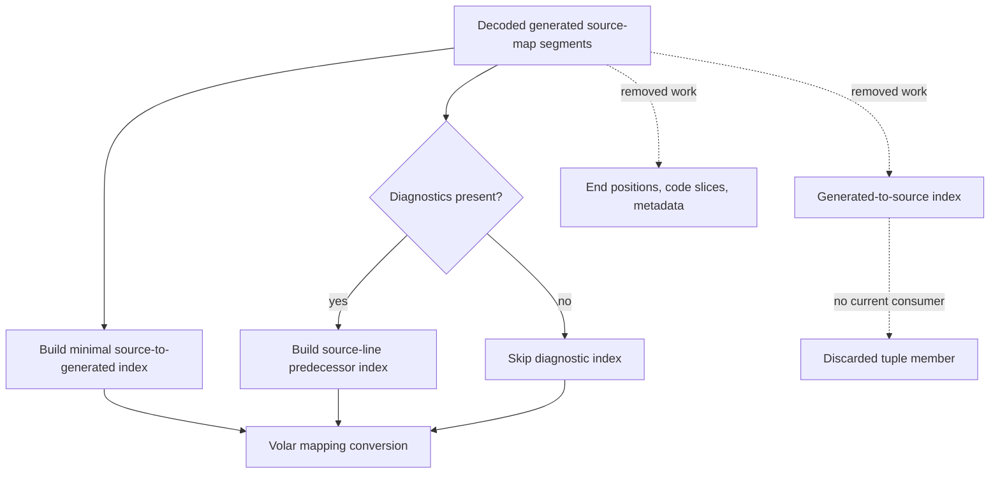
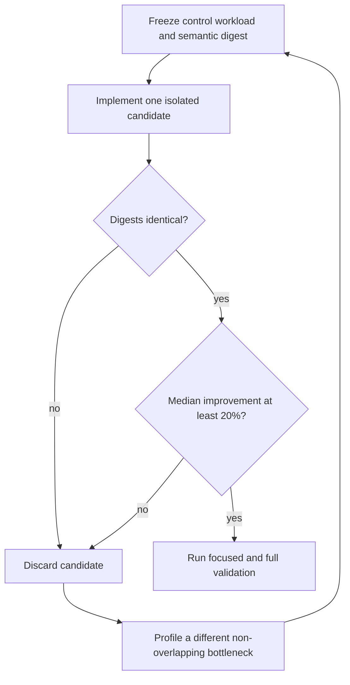

# Source Map Lookup Payload Elision - Plan

## Goal Capsule

- **Objective:** Developers working in mapping-heavy TSRX modules receive faster
  compiler and editor feedback without changes to generated output or language
  tooling behavior.
- **Means:** Stop materializing the private generated-to-source index and
  per-position payload that every current mapping caller discards (KTD1).
- **Authority:** Mapping correctness and public package contracts outrank
  benchmark gains. The user request and R1-R8 outrank implementation convenience.
- **Execution profile:** Establish a frozen control and semantic digest before
  production edits. Remove any attempt that fails the semantic or performance
  gate.
- **Stop conditions:** Do not ship a mapping, diagnostic, generated-code, CSS, or
  public API change. If this hypothesis fails, discard it and validate a different
  non-overlapping bottleneck per R6.
- **Tail ownership:** The LFG pipeline owns review, commit, PR creation, and CI
  follow-through after implementation passes this plan.

---

## Product Contract

### Summary

Optimize one private source-map construction path that builds an index and
position fields the compiler never reads. Preserve generated code, source maps,
Volar mappings, CSS, and diagnostics while producing reproducible before-and-after
evidence.

### Problem Frame

`build_src_to_gen_map` decodes every generated source-map segment and constructs
three indexes. The main compiler path consumes the source-to-generated index and
conditionally consumes the source-line predecessor index for diagnostics. No
in-repo caller consumes the generated-to-source index. The live
source-to-generated consumer reads only `line` and `column`, yet every segment
also allocates an end position, generated-code slice, and metadata object.

This repeated work scales with source-map size on every React, Preact, Solid, and
Vue Volar mapping conversion. The repository's package exports do not expose the
builder, so the unused tuple member is a private implementation detail rather than
a supported package API.

Recent performance work already covers location-free AST cloning,
parameter-comment locations, local export scope lookup, keyword-token lookup,
statement-position membership, and parser line lookup. This plan must remain
separate from PRs #3, #5, #7, #17, #19, and #20.

### Requirements

**Performance behavior**

- R1. The selected optimization must stop constructing the unused
  generated-to-source index and unused per-position payload during normal
  source-map conversion.
- R2. A plain TypeScript mapping-heavy synthetic corpus must complete Volar
  mapping generation at least 20% faster than the frozen `origin/main` control
  across five isolated runs.
- R3. Performance evidence counts only when control and candidate produce
  identical semantic digests for generated code, raw source maps, Volar mappings,
  CSS, and diagnostics.
- R4. Measurements must compare independent fresh processes on the same Node
  version, compiler target set, options, and workload.

**Compatibility behavior**

- R5. The source-to-generated index and the conditional source-line diagnostic
  index must retain their current entries, ordering, duplicate handling, and
  post-processing adjustments.
- R6. If the candidate misses R2 or R3, remove it and validate a different
  bottleneck that does not overlap the screened performance PRs. Freeze a
  representative workload before implementing the replacement, then apply the same
  20% median and identical-digest gates.

**Repository constraints**

- R7. Base the work on fetched `origin/main` commit
  `bb8d919fe16f2b9203393ceb2c0d69e16d49ee95` in the isolated worktree.
- R8. Keep the final change internal to compiler implementation and regression
  coverage. Add a changeset only if execution discovers a user-visible package
  contract change.

### Acceptance Examples

- AE1. **Covers R1, R5.** Given a source map with multiple generated segments for
  one source coordinate, when lookup maps are built, then the source-to-generated
  positions contain only `line` and `column`, retain their generated order, and no
  generated-to-source index is materialized.
- AE2. **Covers R3, R5.** Given a successful compile with no diagnostics, when
  Volar mappings are generated, then generated code, raw source-map data, mapping
  data, and CSS match the control exactly.
- AE3. **Covers R3, R5.** Given parser diagnostics at source positions with no
  exact generated segment, when Volar mappings are generated, then the source-line
  predecessor lookup still creates the same diagnostic mappings as the control.
- AE4. **Covers R3, R5.** Given post-processing changes that shift a mapped
  generated position, when lookup maps are built, then the adjusted line and
  column match the control for both positive and negative deltas.
- AE5. **Covers R2-R4.** Given the frozen mapping-heavy corpus, when control and
  candidate run in five isolated processes, then the candidate meets the median
  threshold and every semantic digest matches.

### Scope Boundaries

- Include the private map builder, dead `CodePosition` payload cleanup, focused
  regression coverage, shared compiler verification, and throwaway benchmark
  evidence.
- Exclude source-to-generated lookup redesign, decoded-segment restructuring,
  keyword-token indexing, parser location caching, CSS pruning, AST cloning, and
  runtime behavior.
- Exclude committed benchmark infrastructure unless implementation finds an
  established repository requirement for it.

---

## Planning Contract

### Key Technical Decisions

- KTD1. **Preserve the tuple shape with an empty reverse-index slot.** Replace the
  unused generated-to-source map with a non-materialized sentinel while leaving
  the first and third tuple positions intact. Store only `line` and `column` in
  the live private maps. This avoids touching the mapping conversion call site
  that overlaps PR #17.
- KTD2. **Confine production work to `source-map-utils.js`.** Remove only data
  proven dead at the private consumer boundary. Preserve decoded-segment
  traversal, adjustment logic, duplicate handling, and public `CodePosition`
  exports.
- KTD3. **Characterize the minimal private contract before changing it.** Add
  focused coverage for minimal generated positions, the absent reverse index, the
  optional source-line map, duplicate source coordinates, and post-processing
  adjustments.
- KTD4. **Measure the public compiler path, not only the helper.** The benchmark
  must exercise Volar mapping generation across representative in-repo targets so
  the result includes the saved work in its real caller.
- KTD5. **Treat a weak result as a rejected hypothesis.** R6 governs the pivot. Do
  not lower the threshold, keep speculative code, or claim a microbenchmark-only
  win.

### High-Level Technical Design

The first diagram shows the data that remains live after the optimization.

The second diagram owns the autonomous hypothesis gate.

### Assumptions

- The repository's root package export map is the supported public boundary.
  Direct imports of `packages/tsrx/src/source-map-utils.js` are not a
  compatibility surface.
- No in-repo caller uses the generated-to-source tuple member. The current call
  sites and tests destructure only the first map and, when needed, the third map.
- A plain TypeScript corpus with many mapped declarations and identifiers will
  produce enough segments to expose lookup payload construction without conflating
  the result with the parser line-lookup hot path owned by PR #20.
- A 20% median reduction is the minimum useful result for the dedicated
  mapping-heavy workload. A smaller result triggers R6.

### Sequencing

1. Freeze the control revision, workload, output digest, and measurement method.
2. Add focused characterization that fails on the intended absent reverse index
   and minimal private position contract.
3. Remove reverse-index and dead position-payload materialization without changing
   the live indexes.
4. Re-run the frozen benchmark and semantic comparison.
5. Remove benchmark scratch files and every abandoned candidate before final
   validation.

### Risks and Dependencies

- **Hidden deep imports:** An out-of-repo consumer could bypass the package export
  map and depend on the private tuple member. Keep the public exports unchanged
  and call this out in review rather than preserving permanent compiler waste for
  an unsupported import.
- **Semantic coupling:** Dead payload construction currently happens beside
  source-to-generated insertion. A broad loop rewrite could change insertion order
  or adjustment behavior. KTD2 keeps traversal and live-map logic intact.
- **Benchmark dilution:** Parsing, transforms, printing, and mapping share the
  measured entry point. Use a mapping-heavy corpus, isolated runs, and the
  dedicated helper timing as diagnostic evidence, but accept the result only when
  the end-to-end gate in R2 passes.
- **Open-branch conflict:** PR #17 changes
  `packages/tsrx/src/transform/segments.js` and shared mapping tests. KTD1-KTD3
  keep the intended production edit and focused test in non-overlapping files.
- **Hypothesis risk:** Removing only the discarded reverse index may not dominate
  total conversion time. R6 permits a clean pivot to the adjacent dead position
  payload while still requiring a newly frozen representative workload and the
  unchanged semantic gate.

### System-Wide Impact

The core source-map builder feeds React, Preact, Solid, and Vue compiler targets.
The change affects compile-time allocation and CPU only. Runtime packages, emitted
application behavior, build-plugin contracts, and editor mapping semantics remain
unchanged.

### Sources and Research

- `packages/tsrx/src/source-map-utils.js` owns all construction of the
  generated-to-source index and the dead end-position, code-slice, and metadata
  payload.
- `packages/tsrx/src/transform/segments.js` consumes only the source-to-generated
  map and the optional source-line map.
- `packages/tsrx/tests/shared/source-mappings.js` is the cross-target mapping
  contract used by React, Preact, Solid, and Vue compiler suites.
- `packages/tsrx/src/index.js` and `packages/tsrx/package.json` confirm that the
  map builder is not part of the supported `@tsrx/core` export surface.
- `vitest.config.js` defines the `tsrx-utils` and four target compiler projects
  used by the verification contract.
- Recent non-overlap evidence comes from PRs #3, #5, #7, #17, #19, and #20 in
  `tsrx-org/tsrx`, checked on 2026-08-28.
- No `CONCEPTS.md`, product strategy file, or `<root>/solutions/` corpus exists in
  this repository, so current source, tests, project instructions, and PR history
  are the planning authorities.

---

## Implementation Units

### U1. Characterize mapping indexes and freeze the performance control

- **Goal:** Lock the live source-map lookup behavior and establish reproducible
  control evidence before implementation.
- **Requirements:** R3-R7; AE1-AE5.
- **Dependencies:** None.
- **Files:**
  - Create `packages/tsrx/tests/utils/source-map-utils.test.js`.
- **Approach:**
  1. Exercise the private builder with encoded mappings that cover duplicate
     source coordinates, adjacent generated segments, post-processing changes, and
     the optional source-line map.
  2. Assert the live first and third tuple positions expose the minimal generated
     position contract at the smallest direct seam.
  3. Add characterizations for the intended non-materialized second slot and
     absent dead position fields so the production edit has focused failing tests.
  4. Build a throwaway mapping-heavy compiler benchmark against the frozen control
     and record a combined semantic digest.
- **Execution note:** Establish the control measurement and characterization
  before modifying `packages/tsrx/src/source-map-utils.js`.
- **Patterns to follow:** Mirror the direct `build_src_to_gen_map` setup in
  `packages/tsrx/tests/shared/source-mappings.js` and the focused utility-test
  style under `packages/tsrx/tests/utils/`.
- **Test scenarios:**
  - Covers AE1. Encode multiple generated segments for one source coordinate and
    assert ordered minimal source-to-generated positions with a non-materialized
    reverse slot.
  - Covers AE3. Enable the source-line predecessor map and assert every source
    column points to the same generated position as the control.
  - Covers AE4. Apply a positive and negative post-processing delta at segment
    boundaries and assert adjusted positions match frozen control fixtures.
  - Exercise an empty mappings string and lines containing only unmapped segments
    without creating spurious entries.
- **Verification:** The focused test fails against the control only for the new
  reverse-slot expectation. The frozen benchmark reports stable control medians
  and identical control digests across repeated runs.

### U2. Remove dead source-map lookup payload

- **Goal:** Eliminate the unused per-segment map work while preserving every live
  mapping contract.
- **Requirements:** R1-R8; AE1-AE5.
- **Dependencies:** U1.
- **Files:**
  - Modify `packages/tsrx/src/source-map-utils.js`.
  - Verify `packages/tsrx/tests/utils/source-map-utils.test.js`.
  - Verify `packages/tsrx/tests/shared/source-mappings.js`.
- **Approach:**
  1. Remove the generated-location key, reverse entry array, end-position lookup,
     generated-code slice, and metadata object construction governed by KTD1-KTD2.
  2. Preserve the first and third tuple members, segment traversal order,
     generated position adjustment, and post-processing behavior.
  3. Re-run the frozen control comparison and discard the production edit if R2 or
     R3 fails.
  4. If discarded, follow KTD5 and R6 with a newly frozen workload before
     implementing another candidate.
- **Patterns to follow:** Keep private helper naming, JSDoc imports, tuple
  documentation, and explicit map types consistent with
  `packages/tsrx/src/source-map-utils.js`.
- **Test scenarios:**
  - All U1 source-to-generated and source-line map cases pass after the production
    change.
  - Covers AE2. A no-error mapping conversion produces byte-identical generated
    code, raw source-map data, Volar mappings, and CSS across all target
    compilers.
  - Covers AE3. An error-bearing conversion produces the same diagnostic list and
    fallback mapping digest as the control.
  - Covers AE5. The mapping-heavy corpus meets the median threshold with identical
    per-run semantic digests.
- **Verification:** Focused utility coverage, cross-target mapping suites, core
  typechecking, formatting, the full repository test suite, and the performance
  gate all pass. The final diff contains no benchmark scratch files or rejected
  implementation.

---

## Verification Contract

| Gate                          | Scope                                                                                                     | Done signal                                                                                                             |
| ----------------------------- | --------------------------------------------------------------------------------------------------------- | ----------------------------------------------------------------------------------------------------------------------- |
| Focused map-builder coverage  | `pnpm exec vitest run --project tsrx-utils packages/tsrx/tests/utils/source-map-utils.test.js`            | Minimal live map entries, ordering, adjustment behavior, the optional diagnostic map, and the absent reverse slot pass. |
| Cross-target mapping suites   | `pnpm exec vitest run --project tsrx-react --project tsrx-preact --project tsrx-solid --project tsrx-vue` | React, Preact, Solid, and Vue mapping suites pass.                                                                      |
| Core typecheck                | `pnpm exec tsgo --noEmit -p packages/tsrx/tsconfig.json`                                                  | No type errors.                                                                                                         |
| Full tests                    | `pnpm test`                                                                                               | All configured repository projects pass with no new skips.                                                              |
| Formatting and diff integrity | `pnpm format:check` and `git diff --check`                                                                | Repository formatting and whitespace checks pass.                                                                       |
| Changeset policy              | `pnpm changeset:check`                                                                                    | Internal-only diff passes without a changeset, or a patch changeset exists if a public contract changed.                |
| Performance and semantic gate | Frozen-control benchmark from U1                                                                          | Candidate median is at least 20% faster across five isolated runs and all semantic digests are identical.               |

No browser test is required for this internal compiler and mapping-only change.

---

## Definition of Done

- R1-R8 are satisfied and AE1-AE5 are covered.
- U1 records a stable frozen-control measurement and focused private-contract
  characterization.
- U2 removes the unused index and dead position payload and passes the semantic
  and performance gates.
- The branch remains based on the fetched default branch in the isolated worktree
  and does not duplicate or modify the hot paths owned by recent performance PRs.
- No public API, generated-code contract, raw source-map contract, mapping
  contract, diagnostic contract, CSS contract, dependency, or runtime behavior
  changes.
- The final diff contains only the intended source, regression coverage, and this
  plan artifact. Throwaway benchmarks and failed approaches are removed.
- No changeset is added unless the final diff contains a user-visible package
  change.
- If the first hypothesis fails, the run is not complete until a different
  non-overlapping optimization meets R6.
